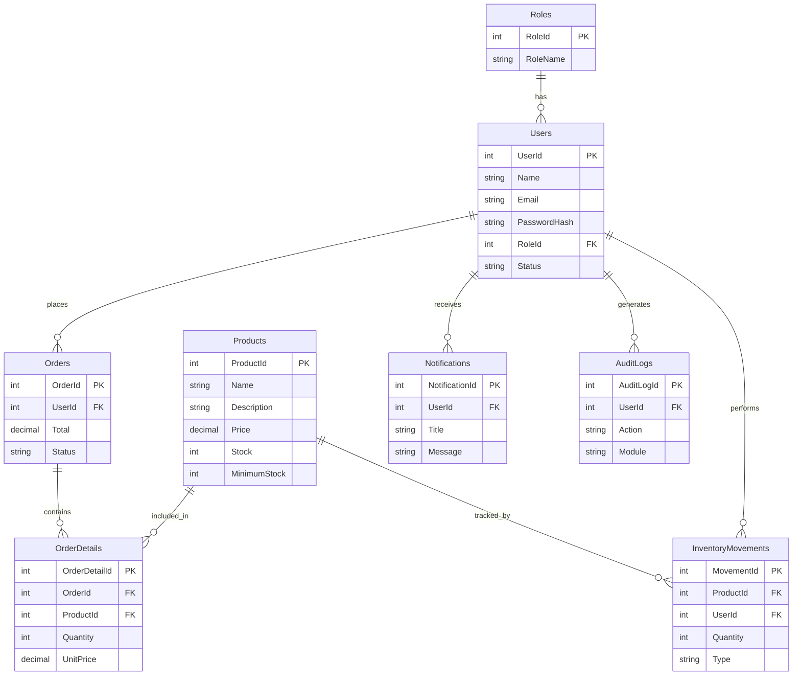

# Database Design

## Users

- UserId
- Name
- Email
- PasswordHash
- RoleId
- Status

## Roles

- RoleId
- RoleName

## Products

- ProductId
- Name
- Description
- Price
- Stock
- MinimumStock

## Orders

- OrderId
- UserId
- Total
- Status

## AuditLogs

- AuditLogId
- UserId
- Action
- Date

## Categories

- CategoryId
- Name
- Description

## InventoryMovements

- MovementId
- ProductId
- Quantity
- Type
- UserId
- Date

## OrderDetails

- OrderDetailId
- OrderId
- ProductId
- Quantity
- UnitPrice

## Notifications

- NotificationId
- Title
- Message
- IsRead
- CreatedAt

## Relationships

Roles (1) -> (N) Users

Users (1) -> (N) Orders

Orders (1) -> (N) OrderDetails

Products (1) -> (N) OrderDetails

Products (1) -> (N) InventoryMovements

Users (1) -> (N) AuditLogs

Users (1) -> (N) Notifications

